# **Задание №2**

1. 15:29:49.336262: loading io.vertx    -   Старт загрузки классов в Metaspace из внешней библиотеки io.vertx

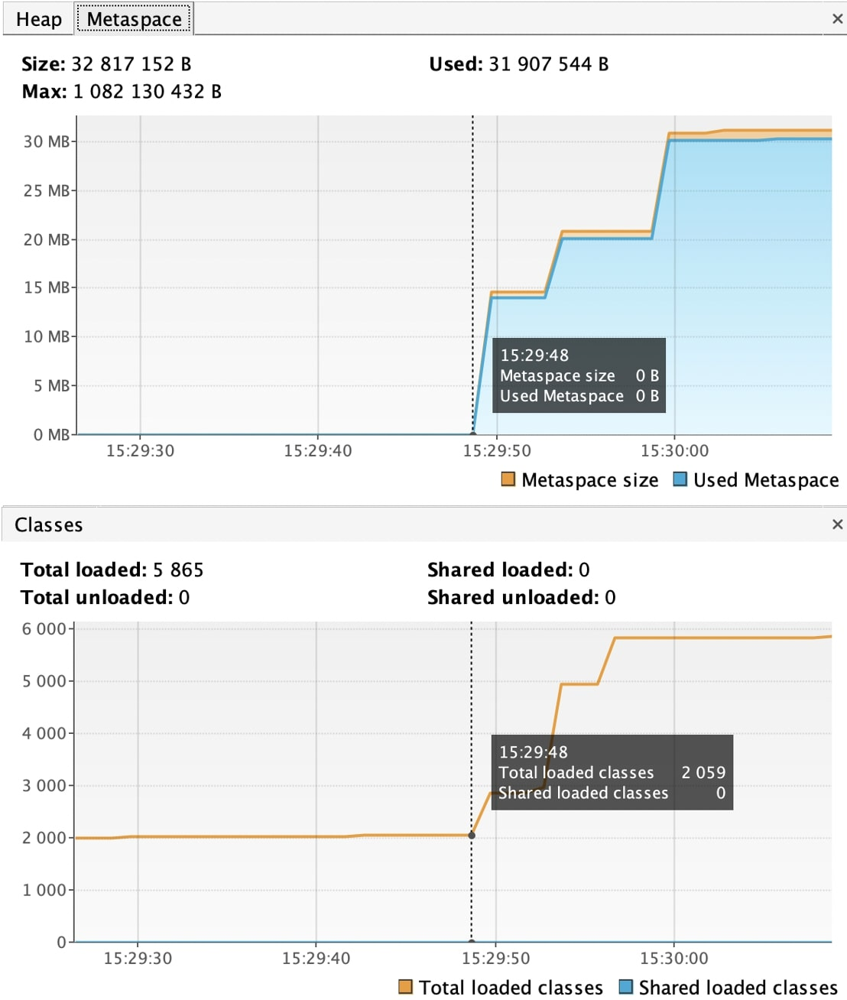

2. 15:29:49.517250: loaded 529 classes  -   Закончена загрузка классов в Metaspace из внешней библиотеки io.vertx 

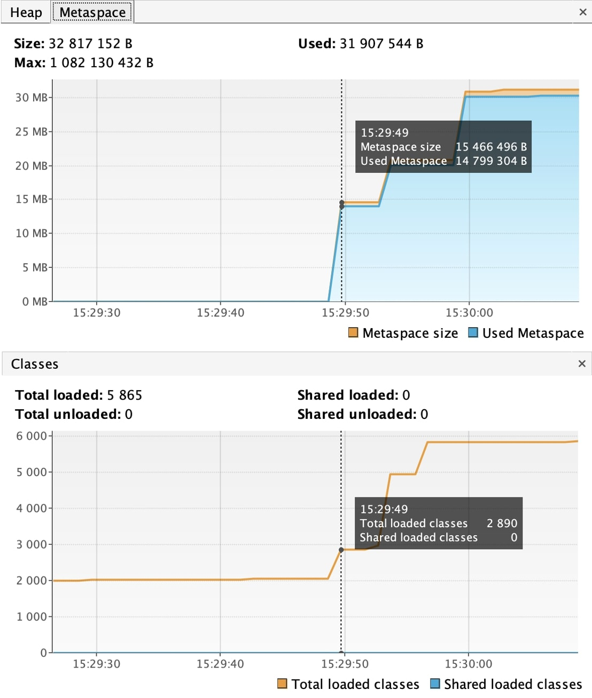

3. 15:29:52.524133: loading io.netty    -   Старт загрузки классов в Metaspace из внешней библиотеки io.netty

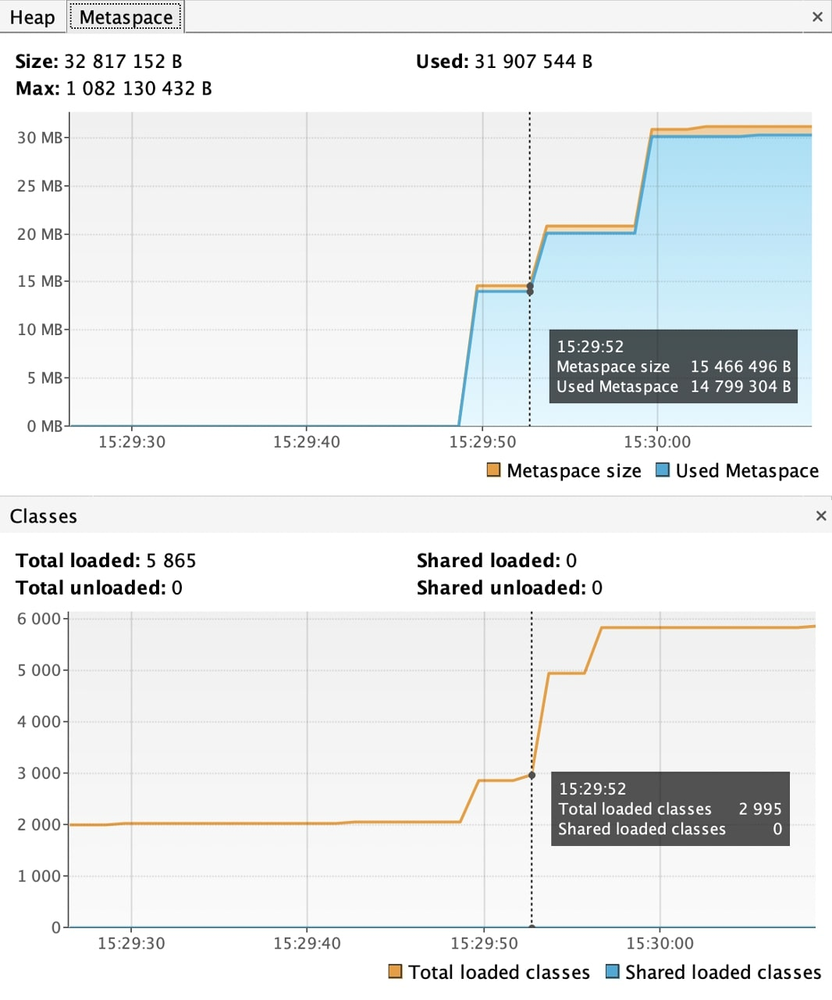

4. 15:29:52.816981: loaded 2117 classes -   Закончена загрузка классов в Metaspace из внешней библиотеки io.netty 

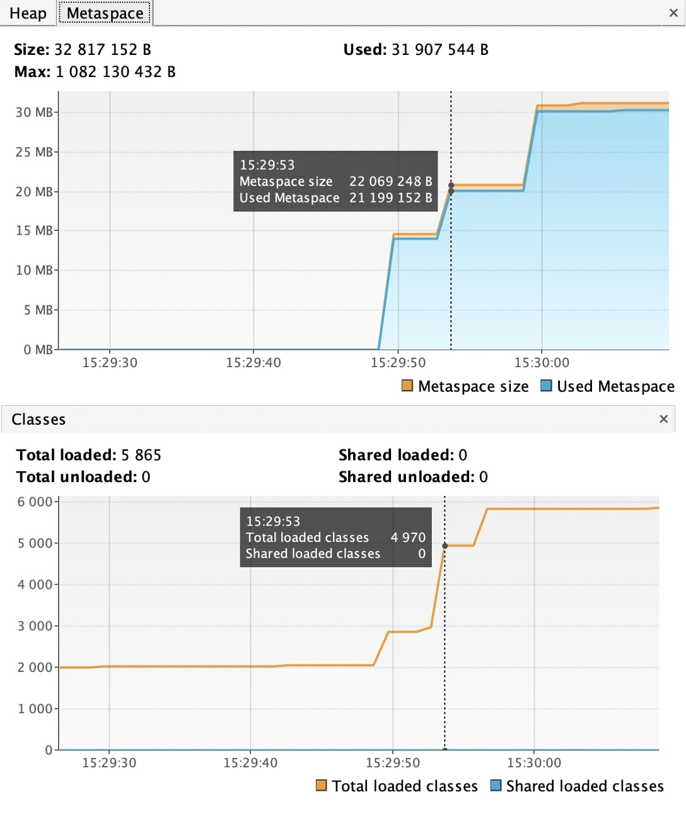

5. 15:29:55.822092: loading org.springframework -   Старт загрузки классов в Metaspace из внешней библиотеки org.springframework

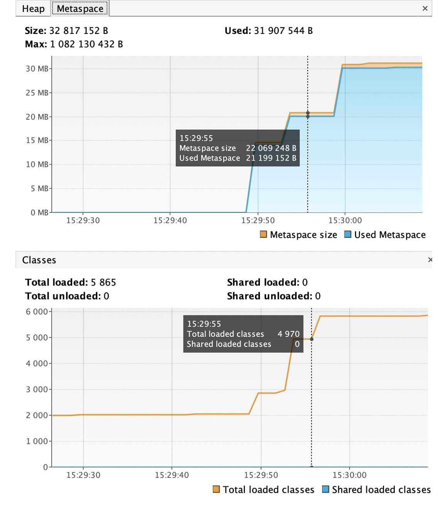

6. 15:29:55.930187: loaded 869 classes  -   Закончена загрузка классов в Metaspace из внешней библиотеки org.springframework (память в Metaspace не увеличилась)

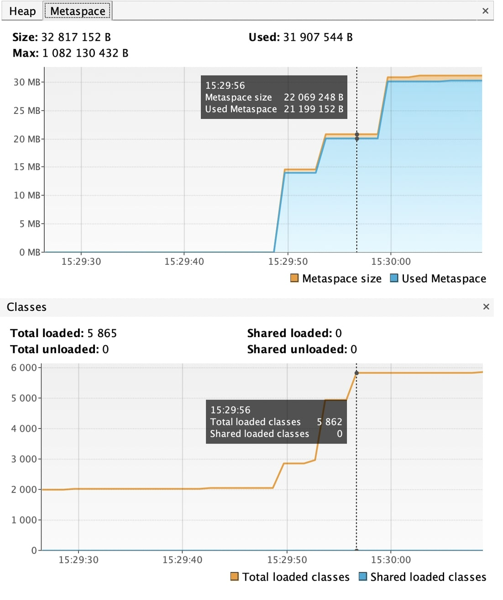

7. 15:29:58.936864: creating 5000000 objects    -   Старт создания списка из 5 млн SimpleObject в heap (куче) 

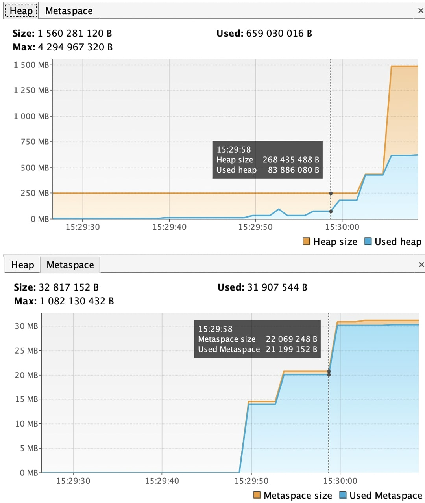

8. 15:29:59.076221: created -   окончание создания списка из 5 млн SimpleObject в heap (куче) 

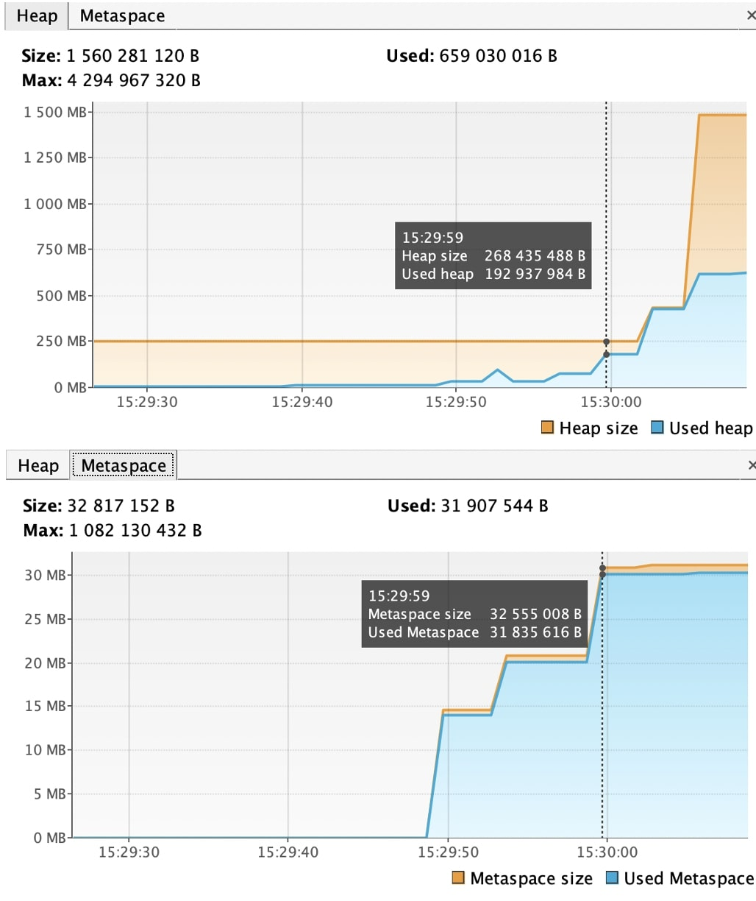

9. Выделение памяти в heap (куче) для добавления в созданный список новый список из 5 мил SimpleObject

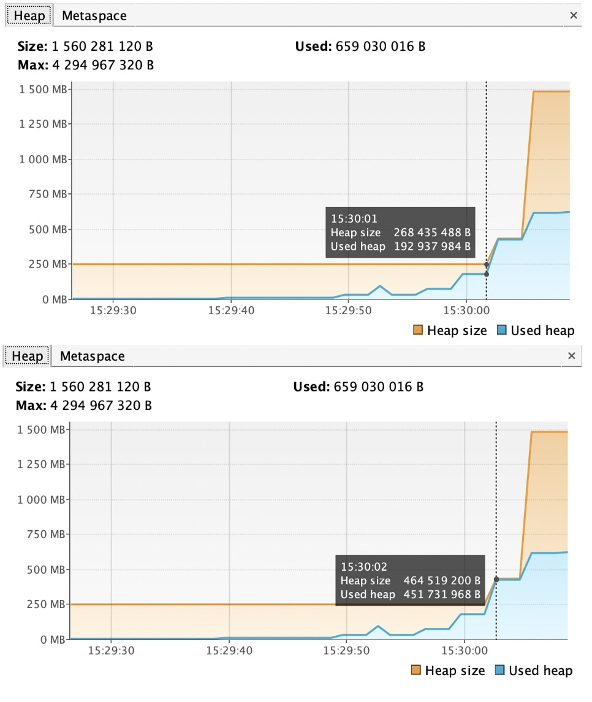

10. 15:30:02.081757: creating 5000000 objects    -   Старт создания нового списка из 5 млн SimpleObject в рамках выделенной памяти
11. 15:30:02.228420: created    -   окончание создания нового списка из 5 млн SimpleObject в heap (куче)

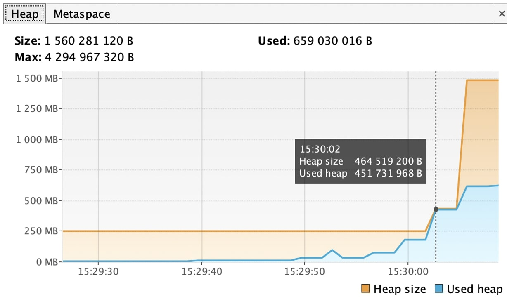

12. Выделение памяти в heap (куче) для добавления в созданный список новый список из 5 мил SimpleObject

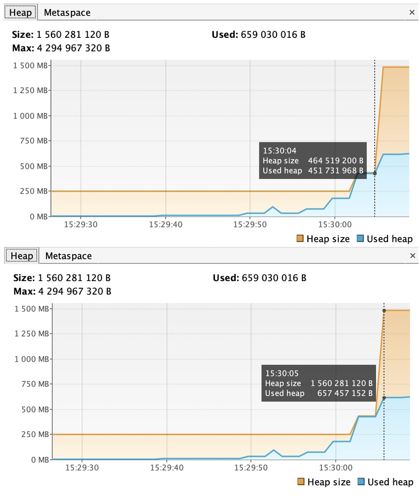

13. 15:30:05.261295: creating 5000000 objects    -   Старт создания нового списка из 5 млн SimpleObject в рамках выделенной памяти
14. 15:30:05.372490: created    -   окончание создания нового списка из 5 млн SimpleObject в heap (куче)
